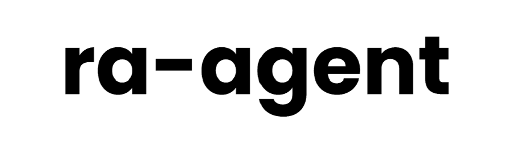
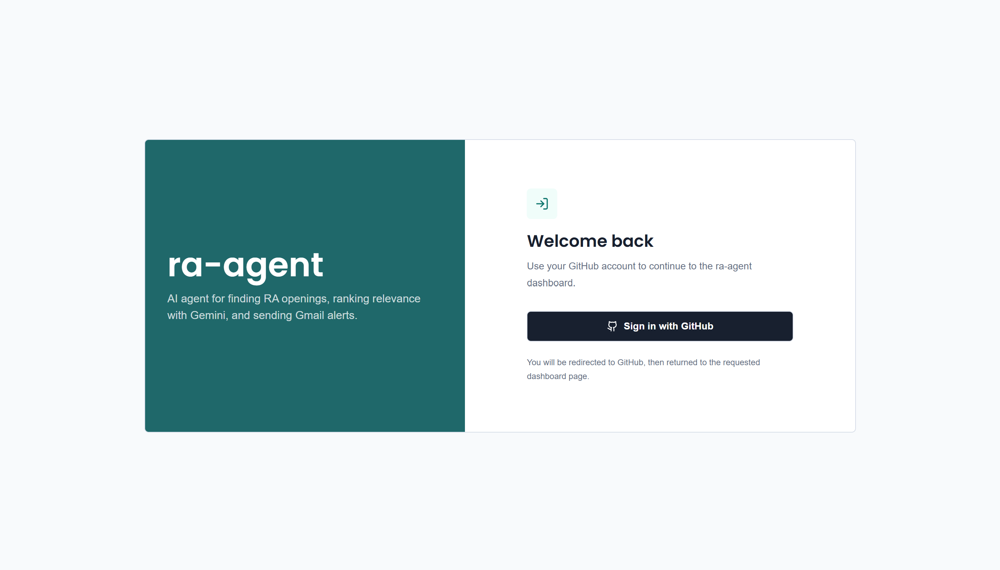
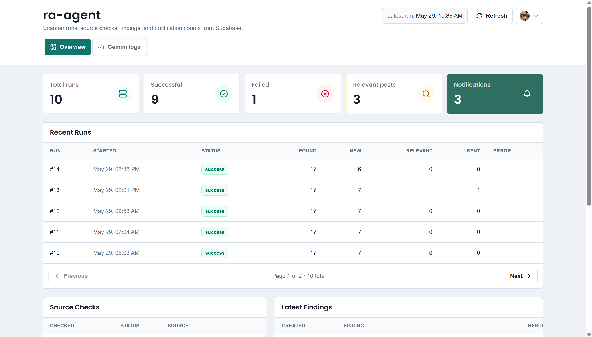
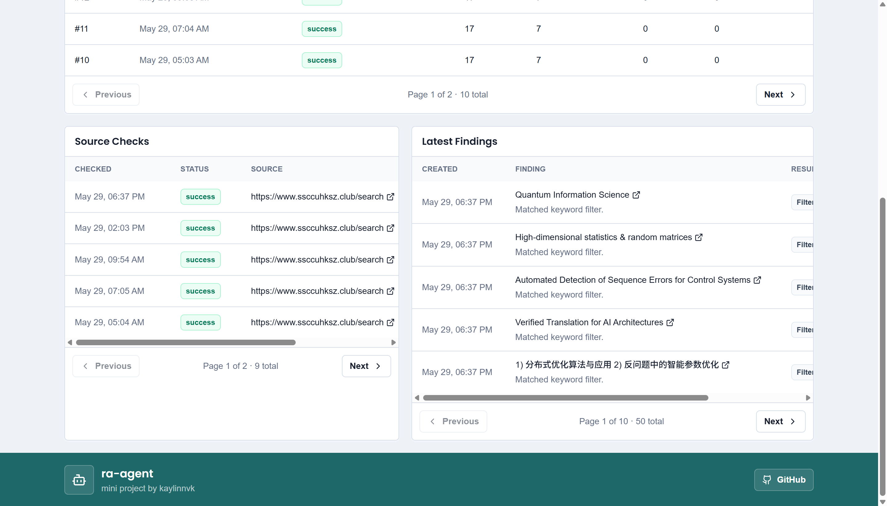
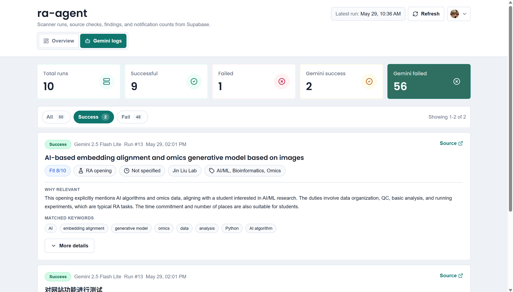
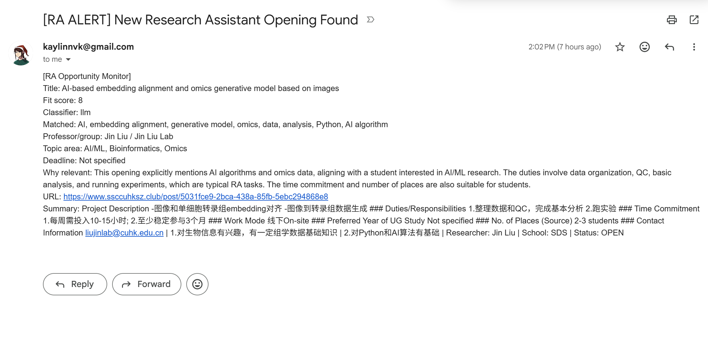

<p align="center">
  
</p>

<p align="center">
  <a href="https://nextjs.org"></a>
  <a href="https://www.python.org"></a>
  <a href="https://react.dev"></a>
  <a href="https://www.typescriptlang.org"></a>
  <a href="https://supabase.com"></a>
  <a href="https://ai.google.dev/gemini-api"></a>
  <a href="https://github.com/features/actions"></a>
  <a href="https://vercel.com"></a>
</p>

RA Agent scans RA/research opportunity posts, filters them for relevance, sends email alerts, and displays run logs in a small protected web dashboard.

## Demo

<p align="center">
  
  
</p>

<p align="center">
  
  
</p>
<p align="center">
  
</p>

## Features

- Hourly RA website scanning through GitHub Actions
- Deduplication so already-seen posts are ignored
- Keyword relevance scoring with a minimum score threshold
- Gemini classification for relevant candidates
- Gmail notifications for new relevant RA posts
- Supabase Postgres storage for runs, source checks, findings, and LLM logs
- Configurable operational-log retention with throttled seen-post timestamps
- Vercel-hosted Next.js dashboard
- GitHub OAuth login with Auth.js, including a dev-only auth bypass for local UI work

## How It Works

1. GitHub Actions runs the scanner every hour.
2. The scanner extracts candidate posts from links, page cards, JSON data, and simple API feeds.
3. Already-seen posts are skipped using normalized URL and content hash deduplication.
4. New posts go through the local relevance filter. Posts with score lower than `MIN_SCORE` are saved as non-relevant and do not trigger notifications.
5. Relevant candidates are sent to Gemini for deeper classification, including fit score, matched keywords, professor/group, topic area, deadline, and reasoning.
6. New relevant posts trigger a Gmail notification.
7. Results are saved to Supabase Postgres.
8. The Vercel web app reads the same database and shows scanner runs, source checks, findings, and Gemini logs.

## Setup

### 1. Install Python dependencies

```bash
python -m venv .venv
.venv\Scripts\Activate.ps1
pip install -r requirements.txt
copy .env.example .env
```

### 2. Configure `.env`

Minimum local scanner config:

```env
RA_WEBSITE_URL=https://example.com/ra-recruitment-page
MIN_SCORE=2
DB_BACKEND=sqlite
SQLITE_PATH=data/ra_agent.sqlite
USE_LLM_CLASSIFIER=true
GEMINI_API_KEY=your_gemini_api_key
```

For production scanner runs, use Supabase Postgres:

```env
DB_BACKEND=postgres
DATABASE_URL=postgresql://...
DATA_RETENTION_DAYS=90
SEEN_POST_TOUCH_INTERVAL_HOURS=24
```

Operational run, source, finding, and Gemini history is retained for 90 days by
default. Dashboard totals cover that retained window. `seen_posts` is kept
indefinitely so an old listing cannot become new again after cleanup, while its
`last_seen_at` timestamp is updated at most once every 24 hours. Set
`DATA_RETENTION_DAYS=0` to keep operational history indefinitely, or
`SEEN_POST_TOUCH_INTERVAL_HOURS=0` to restore an update on every sighting.

For Gmail alerts:

```env
GMAIL_HOST=smtp.gmail.com
GMAIL_PORT=587
GMAIL_USER=yourgmail@gmail.com
GMAIL_APP_PASSWORD=your_app_password
GMAIL_TO=yourgmail@gmail.com
```

### 3. Run the scanner

```bash
python -m src.main --once
```

Useful checks:

```bash
python -m src.main --check-db
python -m src.main --dry-run
python -m src.main --test-gmail
```

### 4. Run the dashboard

```bash
npm install
npm run dev
```

Set these for the dashboard:

```env
DATABASE_URL=postgresql://...
AUTH_SECRET=your_auth_secret
AUTH_URL=http://localhost:3000
AUTH_TRUST_HOST=true
AUTH_GITHUB_ID=your_github_oauth_client_id
AUTH_GITHUB_SECRET=your_github_oauth_client_secret
```

For local UI work without GitHub OAuth:

```env
DISABLE_AUTH_IN_DEV=true
```

### 5. Deploy

- Add scanner secrets to GitHub Actions: `DATABASE_URL`, `RA_WEBSITE_URL`, `MIN_SCORE`, `USE_LLM_CLASSIFIER`, `GEMINI_API_KEY`, Gmail settings, and optional retention overrides.
- Deploy the Next.js app to Vercel.
- Add dashboard env vars in Vercel: `DATABASE_URL`, `AUTH_SECRET`, `AUTH_URL`, `AUTH_TRUST_HOST`, `AUTH_GITHUB_ID`, `AUTH_GITHUB_SECRET`.
- Set the GitHub OAuth callback URL to:

```text
https://your-domain.com/api/auth/callback/github
```

## Tests

```bash
python -m unittest
npm run typecheck
```
